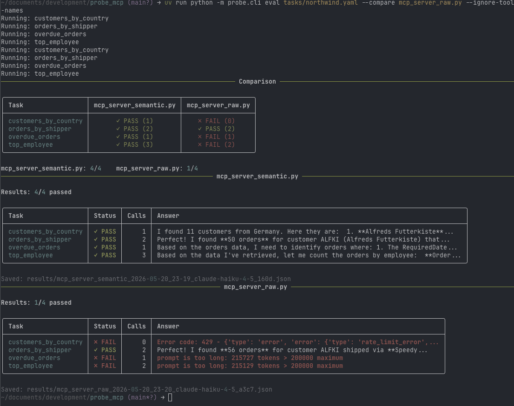

# probe-mcp

An eval harness for MCP servers. Runs a set of natural language tasks against any MCP server, captures the tool call trace, and scores the results against defined expectations.

---

## The problem

When you wrap an existing API as an MCP server, the agent's behavior depends heavily on the quality of the tool definitions, not just the underlying API. Vague descriptions, opaque field names, encoded values, and missing workflow hints all cause agents to fail silently, guess wrong, or crash with context window errors.

There is currently no automated way to measure this. you ship and find out in production.

probe-mcp gives you a test suite for your MCP server.

---

## Use cases

**Before shipping.** Write a set of realistic tasks that represent how agents will use your MCP server. Run them. Find failures before users do.

**After changing tool definitions.** If you improve a docstring, add an enum, or rename a parameter, run the eval again. Confirm the change helped and did not break anything else.

**Comparing raw vs semantic.** Build a naive MCP wrapper and a well-described one. Run the same tasks against both. Measure the difference in pass rate and call efficiency.

**Catching model drift.** A tool definition that worked well with one model version may behave differently after a model update. Run the eval on a schedule to detect regressions.

**Code review for MCP servers.** Use the eval output as evidence in pull requests. A description change that improves pass rate from 2/4 to 4/4 is self-documenting.

---

## Example output

Running the same four tasks against two servers — one with a semantic layer, one without:

```bash
probe-mcp eval examples/northwind/tasks/northwind.yaml --compare raw
```



The comparison table shows the verdict at a glance. The detail tables below explain why each task passed or failed. The raw server crashes on unbounded queries that exceed the context window. The semantic server handles them correctly because tool definitions include a row limit and documented field semantics.

---

## Architecture

<table width="100%"><tr><td>

```
                        ┌─────────────────────────────────────┐
                        │           probe.yaml                │
                        │   agent model, judge model,         │
                        │   results_dir, judge_dir            │
                        └──────────────┬──────────────────────┘
                                       │ config
                                       ▼
┌─────────────┐   tasks   ┌────────────────────────────────────────────────────────┐
│ tasks/*.yaml│ ────────► │                    CLI                                 │
└─────────────┘           │   eval   judge   report   full   init   status   help  │
                          └──────────┬────────────────────────┬────────────────────┘
                                     │                        │
                          ┌──────────▼──────────┐   ┌────────▼────────┐
                          │       runner        │   │      judge      │
                          │                     │   │                 │
                          │ resolves server     │   │ reads results   │
                          │ name via            │   │ calls LLM       │
                          │ servers.yaml,       │   │ saves verdicts  │
                          │ spawns subprocess   │   └────────┬────────┘
                          │ over stdio          │            │
                          │                     │   ┌────────▼────────┐
                          │ runs tasks through  │   │  judge/*.json   │
                          │ LLM autonomously    │   └─────────────────┘
                          └──────────┬──────────┘
                                     │
                          ┌──────────▼──────────┐
                          │       scorer        │
                          │                     │
                          │ checks tool trace   │
                          │ checks call count   │
                          │ checks answer text  │
                          └──────────┬──────────┘
                                     │
                          ┌──────────▼──────────┐   ┌─────────────────┐
                          │      reporter       │   │ results/*.json  │
                          │                     │   │                 │
                          │ Rich tables         │   │ full trace,     │
                          │ color coded status  │   │ scores, meta,   │
                          │ compare tables      │   │ model names,    │
                          │ judge verdicts      │   │ run id          │
                          └─────────────────────┘   └─────────────────┘


                    MCP server subprocess (spawned by runner)
                    ┌──────────────────────────────────────────┐
                    │                                          │
                    │   any command and args from servers.yaml │
                    │   e.g. uv run python mcp_server.py       │
                    │                                          │
                    └──────────────────────────────────────────┘
```

</td></tr></table>

---

## How it works

probe-mcp spawns your MCP server as a subprocess and communicates with it over stdio, the same transport Claude Desktop uses. It then runs each task through a real LLM call with the server's tools attached. The LLM decides autonomously which tools to call and when. The runner captures the full trace and scores it against your expectations.

No mocking. No shortcuts. The eval reflects real agent behavior against a real MCP server.

---

## Setup

**Requirements:** Python 3.12+, uv, an Anthropic API key

```bash
git clone https://github.com/adelkkhalil/probe-mcp
cd probe-mcp
uv sync
```

Set your API key:

```bash
export ANTHROPIC_API_KEY="your-key-here"
```

Add an alias to your shell profile. The alias must preserve your current
working directory so that `init` and `status` create files in the right place:

```bash
# bash or zsh (~/.zshrc or ~/.bash_profile)
alias probe-mcp='PROBE_CWD="$PWD" uv run --directory /path/to/probe-mcp python -m probe.cli'

# fish (~/.config/fish/config.fish)
alias probe-mcp='env PROBE_CWD=(pwd) uv run --directory /path/to/probe-mcp python -m probe.cli'
```

Replace `/path/to/probe-mcp` with the absolute path where you cloned the repo.

Reload your shell:

```bash
source ~/.zshrc
```

Or run directly without an alias:

```bash
PROBE_CWD="$PWD" uv run --directory /path/to/probe-mcp python -m probe.cli [command]
```

## Getting started

```bash
probe-mcp init
```

Creates three files if they do not already exist:

- `probe.yaml` — config file for model selection and output directories
- `servers.yaml` — defines named servers with the command and args to spawn them
- `tasks/my_server.yaml` — sample task file with comments explaining the format

If a file already exists it is skipped with a message. Use `--force` to overwrite.

---

## Server configuration

`servers.yaml` defines named servers. Task files reference servers by name. This lets you use any runtime, venv, or wrapper script — not just Python files in probe-mcp's own venv.

```yaml
servers:
  semantic:
    command: uv
    args: ["run", "--directory", ".", "python", "mcp_server_semantic.py"]

  raw:
    command: uv
    args: ["run", "--directory", ".", "python", "mcp_server_raw.py"]
```

The subprocess is spawned with `command` and `args` exactly as specified, with the working directory set to the directory containing `servers.yaml`. This means relative paths in `args` resolve from that directory.

`servers.yaml` is looked up in the task file's directory first, then in `PROBE_CWD`.

---

## Configuration

`probe.yaml` controls which models run tasks and evaluate results, and where output files are saved:

```yaml
models:
  agent: claude-haiku-4-5   # model used to run tasks
  judge: claude-haiku-4-5   # model used to evaluate results

output:
  results_dir: results
  judge_dir: judge
```

This file is optional. Defaults are used if it does not exist. The model name is always included in output filenames regardless of whether it was explicitly configured.

---

## Commands

```bash
probe-mcp help     Show workflow guide and all commands
probe-mcp init     Create probe.yaml, servers.yaml, and a sample tasks file
probe-mcp status   Show project overview: config, servers, tasks, results, judge files
probe-mcp eval     Run tasks against an MCP server, save results
probe-mcp judge    Evaluate saved results using an LLM judge
probe-mcp report   Print report from saved results
probe-mcp full     Run eval + judge + report in one command
```

Run any command with `--help` for options:

```bash
probe-mcp eval --help
probe-mcp full --help
```

---

## Running the eval

```bash
probe-mcp eval examples/northwind/tasks/northwind.yaml
```

Runs all tasks against the server named in the task file, prints a Rich table of results, saves a JSON results file to `results/`.

```bash
probe-mcp eval examples/northwind/tasks/northwind.yaml --verbose
```

Shows full answers and detail lines in addition to the summary table.

```bash
probe-mcp eval examples/northwind/tasks/northwind.yaml --compare raw
```

Runs the same tasks against two servers (`semantic` from the task file and `raw` from `--compare`) and prints a side-by-side comparison table followed by per-server detail.

```bash
probe-mcp eval examples/northwind/tasks/northwind.yaml --server raw
```

Override the server from the task file with a different named server.

---

## Running the judge

```bash
probe-mcp judge results/semantic_2026-05-20_15-38_claude-haiku-4-5_62f7.json
```

Reads a results file, calls a second LLM to evaluate each answer, saves a judge file to `judge/`. The judge evaluates answer quality beyond structural checks, catching cases where the agent gave a technically passing but misleading answer.

```bash
probe-mcp judge results/file.json --model claude-opus-4-5
```

Override the judge model for a single run.

---

## Full pipeline

```bash
probe-mcp full examples/northwind/tasks/northwind.yaml
```

Runs eval, then judge, then prints the combined report in one command.

---

## Viewing results

```bash
probe-mcp report results/semantic_2026-05-20_15-38_claude-haiku-4-5_62f7.json
```

Prints structural results and judge verdicts together. Automatically finds the matching judge file if present.

---

## Writing tasks

Task files are YAML. The `server` field names a server from `servers.yaml`. Each task has a prompt and a set of expectations split into two named sections:

```yaml
server: semantic

tasks:
  - id: find_orders
    prompt: "Find orders for customer ALFKI shipped via express courier"
    expect:
      deterministic:
        tools_called_includes: [shippers, orders]
        max_calls: 3
        answer_includes: "Speedy Express"
      probabilistic:
        judge: true
```

**`expect.deterministic`** — checks that run mechanically from the tool call trace, no LLM needed:

- `tools_called_includes` — tool names that must appear in the trace
- `max_calls` — maximum number of tool calls allowed
- `answer_includes` — string that must appear in the final answer (case-insensitive)

**`expect.probabilistic`** — checks that require judgment:

- `judge: true` — runs the LLM judge on this task's answer (requires `probe-mcp judge` or `probe-mcp full`)

Both sections are optional. A task with only `deterministic` checks skips the judge. A task with only `probabilistic: {judge: true}` runs the judge with no structural checks.

---

## Northwind example

The repo ships a reference example at `examples/northwind/`. It contains:

- `mcp_server_raw.py` — naive 1:1 wrapper with minimal descriptions
- `mcp_server_semantic.py` — rich descriptions, parameter notes, a `limit` cap, and a composite tool
- `northwind_api.py` + `northwind.db` — the underlying legacy API (SQLite, no MCP)
- `servers.yaml` — defines `semantic` and `raw` server entries
- `probe.yaml` — example config
- `tasks/northwind.yaml` — four tasks covering the northwind API

Run it from the repo root:

```bash
probe-mcp eval examples/northwind/tasks/northwind.yaml
probe-mcp eval examples/northwind/tasks/northwind.yaml --compare raw
```

The two servers demonstrate how tool description quality changes agent behavior on the same underlying API calls.

---

## File naming

Results and judge files include the server name, timestamp, model, and a short random ID:

```
results/semantic_2026-05-20_15-38_claude-haiku-4-5_62f7.json
judge/semantic_2026-05-20_15-38_claude-haiku-4-5_62f7_judge_claude-haiku-4-5_c600.json
```

Every filename reflects exactly what was used. No placeholder model names.

---

## Roadmap

- Multi-model support: run the same tasks against different LLMs and compare results
- Retry with backoff for rate limit errors during judge runs
- More task examples beyond the Northwind baseline
- Pre-built adapters for third-party APIs

---

## Read more

Full write-up with context and analysis: [Your API Works Fine. Your Agent Doesn't.](https://medium.com/@adelkhalil)

---

## License

MIT
